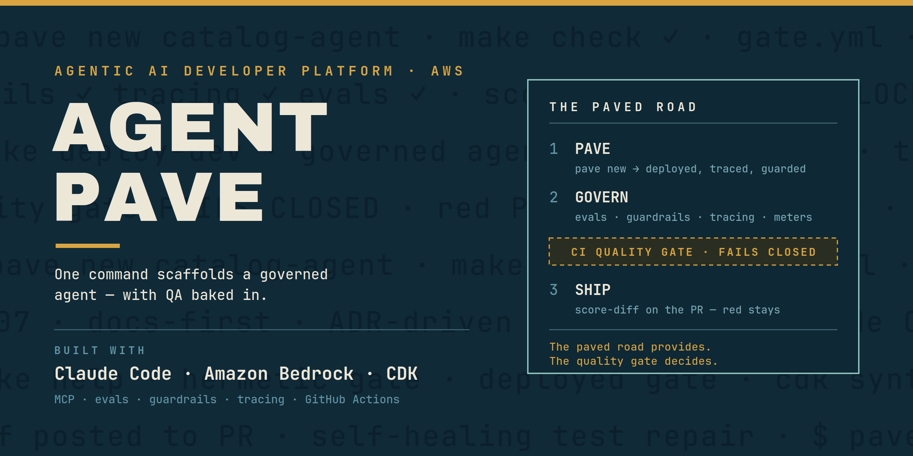
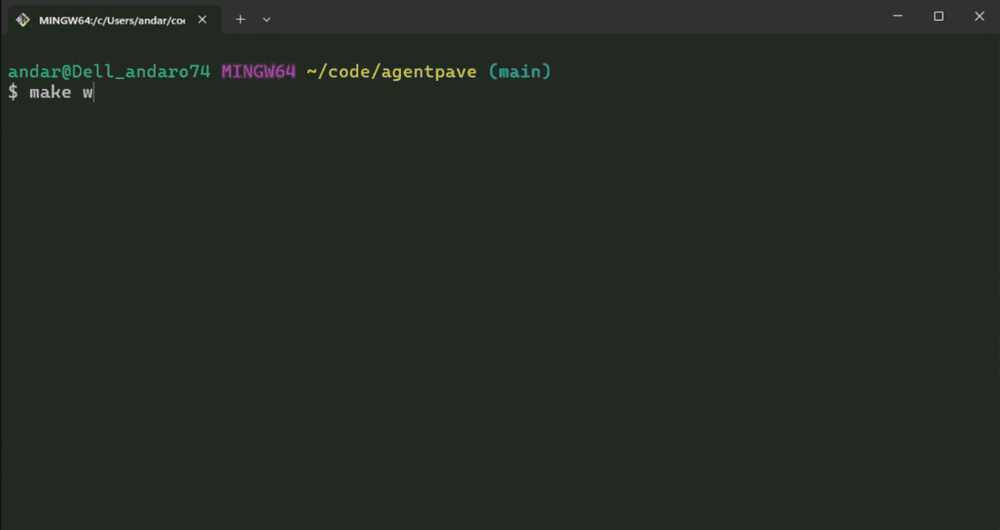
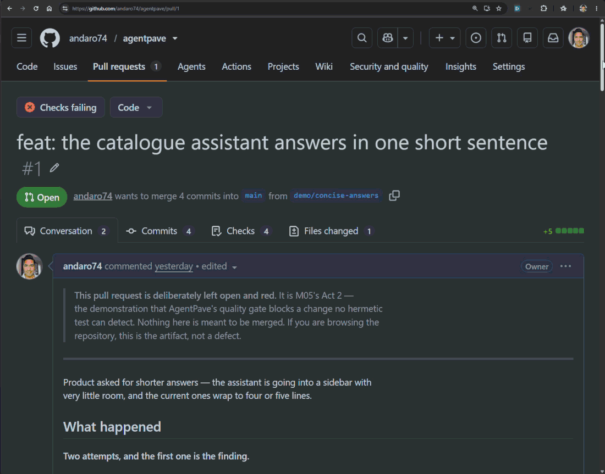
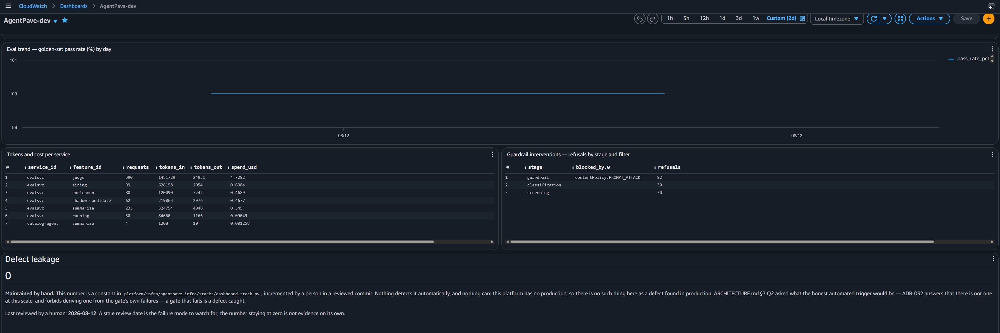

# AgentPave

> **The paved road provides. The quality gate decides.**



**A miniature agentic AI developer platform on AWS with QA baked into the
infrastructure — one command scaffolds a governed agent that arrives with evals,
guardrails, tracing, and a failing-closed CI quality gate already attached.**

Built in public over seven days, one milestone at a time, with
[Claude Code](https://claude.com/product/claude-code) — following the same
docs-first, ADR-driven convention as
[agentic-pii-erasure](https://github.com/andaro74/agentic-pii-erasure).

**38 ADRs · 736 hermetic tests · six stacks · $20.45 of Bedrock, total.**

---

## The problem

Most agentic AI demos prove that *an agent* can work. Very few prove that an
*organisation* of agents can work — that a second, third and tenth team could
ship governed, evaluated, observable agents without rebuilding the same
machinery every time.

That is a platform problem, and this project's thesis is that such a platform's
defining property is **quality engineering baked into the infrastructure**:
evaluation datasets, LLM-as-judge scoring, guardrails, tracing, and a
failing-closed CI gate that every scaffolded service inherits at birth.

AgentPave demonstrates the thesis end to end at deliberately tiny scale. **Tiny
scale, production shape** — every component is the smallest thing that is still
shaped correctly, and every scope cut is an ADR written the day the trade was
made.

The sample service riding the platform is a **Streaming Catalog Concierge**: one
agent answering questions about TV shows and schedules, grounded in the keyless
[TVMaze API](https://www.tvmaze.com/api) exposed as an MCP tool.

---

## Three acts

### Act 1 — The paved road

`pave new catalog-agent --template agent-tools --classification internal` →
scaffold → deploy → a traced, metered, guarded answer. Zero to governed agent in
minutes.



Five things are asserted, and all five are deployed facts rather than mocks:
the service **scaffolded** into its own stack, **answered** grounded via
`search_show`, was **guarded** — an injection blocked at
`contentPolicy:PROMPT_ATTACK` by the platform, not by the model's manners —
**metered** at $0.000629 across two rows, and **traced** with two spans carrying
GenAI semantic-convention attributes.

### Act 2 — The gate bites

A prompt change is blocked by the eval gate, with the score diff posted as a
pull-request comment. A quality regression caught by infrastructure, not by a
user. [The red pull request stays open in
history](https://github.com/andaro74/agentpave/pull/1).



**The first attempt failed to break anything, and that is the more interesting
result.** *"Be concise. Answer in a single short sentence"* scored 31/31, +0.0%
on every capability, and the gate let it through — correctly. Every fact the
golden set grades was still present; a gate that reddened there would be
measuring prose length.

The second attempt — *"a headline, not a sentence: at most eight words"* —
blocked at **29/31, −6.5%**, and the drop was targeted rather than diffuse:
`airing` −11.1%, `running` −16.7%, while `summarize` and `enrichment` held at
100%. Enrichment holding is the tell: it answers through a prompt the change
never touched. Both attempts passed `make check` in full, because nothing
hermetic can see how long an answer is — which is the entire reason the eval
level exists.

### Act 3 — Self-healing, human-triggered

A tool schema change breaks a contract test. `pave selfheal` classifies the
failure as **schema drift** rather than a real defect, and a **human runs Claude
Code against that verdict** — it proposes the repaired declaration as an
`ai-proposed` pull request, a second human approves, and it passes the same
`gate verdict` check as anything else.


**The model call is made by a person, not by a GitHub Action**, and that is a
decision rather than a shortcut. Running Claude Code headless in CI needs an
identity holding `bedrock:InvokeModel`, which would weaken the platform's first
invariant — no service holds Bedrock permissions of its own — permanently, to
buy one demo act, on the riskiest surface in the project: a credentialed agent
with pull-request write and a prompt-injection path through the repository it
reads. The trade was declined
([ADR-035](docs/adr/ADR-035-selfheal-in-ci-deferred.md)). The classifier — the
half that decides whether an AI may be pointed at a failure at all — ships, and
is tested.

**The AI did not fix the real finding, and that is the result.** The repair
turned the suite green, but the assertion it satisfied was *vacuous*: the
contract suite compares union-typed parameters as `None` to `None`, so the new
parameter would have passed declared as a string, a list, or an object. Fixing
that means editing a comparison helper so that one's own change passes — exactly
the move the `schema_drift` licence excludes. A more permissive classifier would
have closed the test and the finding in one commit, and nobody would have
learned the assertion had ever been empty. It went into the pull request body as
a reviewer's decision and became
[ADR-037](docs/adr/ADR-037-contract-suite-does-not-check-union-types.md).

---

## Architecture



A fuller, AWS-shaped view is in
[`docs/ARCHITECTURE.md`](docs/ARCHITECTURE.md), which is the spec this was built
against.

**Five invariants, each enforced rather than asserted:**

1. **Every model call goes through the gateway.** No service holds Bedrock
   permissions of its own — checked by IAM assertions at `cdk synth`.
2. **Quality gates fail closed.** A gate that errors blocks; it never skips.
3. **Nothing bills while idle.** Lambda, DynamoDB on-demand, S3 — no provisioned
   floors ([ADR-002](docs/adr/ADR-002-nothing-bills-while-idle.md)).
4. **`make check` is hermetic** — no AWS account, no network beyond localhost.
5. **Adversarial probes pass on "guardrail blocked, or policy denied and
   logged"** — never on "the model resisted."

The tool registry declares owner, semver, JSON schemas and a consequence class
per tool, and Cedar binds agent identity to the tools it may call, evaluated
in-process. Schema drift between the registry and what the MCP server advertises
fails the hermetic gate — **except in the types of union-typed parameters**,
where the comparison is vacuous
([ADR-037](docs/adr/ADR-037-contract-suite-does-not-check-union-types.md)).

The dashboard is Logs Insights queries over structured log lines, never custom
metrics, because metrics bill while idle
([ADR-030](docs/adr/ADR-030-dashboard-reads-logs-not-custom-metrics.md)).



---

## Quick start

```bash
make help          # every verb, and which milestone it arrived in
make install       # uv sync, and create .env from .env.example
make check         # the hermetic gate — lint, 736 tests, policy, cdk synth
```

`make check` needs **no AWS account**. It does need Python 3.12, [uv](https://docs.astral.sh/uv/)
and the CDK CLI (`npm install --global aws-cdk@2`) — the target says so itself
rather than failing as an errno, which it learned the hard way.

Everything that touches AWS lives behind an explicit verb:

```bash
make deploy-dev        # ⚠️ creates real infrastructure in us-west-2
make walkthrough       # Act 1 end to end against the deployed stacks
make smoke-gateway     # a guarded, metered completion; a must-block prompt blocked
make conformance       # the contract suite, against the deployed MCP tool
make eval              # the golden-set scorecard, and moves the baseline
make eval-adversarial  # the probes only
make shadow-eval       # candidate vs. incumbent — the canary stand-in
make destroy-dev       # tear it all down
```

Scaffolding a new governed service is one command:

```bash
uv run pave new my-agent --template agent-tools --classification internal
```

It renders the service with the gateway SDK pre-wired, OTEL, a seed dataset,
judge config, its own `gate.yml`, an IAM role with a permission boundary, tool
bindings derived from Cedar, and a budget alarm.

---

## By the numbers

Everything here is measured, not estimated. The gateway meters every request —
served, refused or blocked — so the platform's own cost is a query rather than an
invoice reconstruction.

| | |
|---|---|
| Total spend, seven days, everything | **$20.45** |
| Cost of the answers the product actually served | **$0.0031** (10 requests) |
| Share of spend that is LLM-as-judge | **69%** ($14.11) |
| One graded eval run — 31 cases, 10 adversarial probes | **$0.4723** |
| One shadow-eval run (golden set served twice) | **$0.915 / $0.936** — 1.94× and 1.98× an eval run |
| A pull request blocked at the hermetic level | **$0** — L2 needs L0 to pass, so a broken contract never buys an eval |
| A docs-only pull request | **$0** — the graded levels skip, and the skip stays a visible skip |
| Idle cost | **$0** — no provisioned floors |
| Run-to-run reproducibility | **±0.05%** across a laptop and two GitHub runners |
| Judge agreement with hand-labelled answers | **90%** against a 0.8 floor |
| Hermetic gate | **736 tests**, ~15s, no AWS account |
| From nothing to a working platform | `make deploy-dev` |

Two lines are worth pausing on: **the QA machinery cost roughly 6,500× the
product it was grading**, and **the judge is 69% of that**. At this scale that is
the correct trade — the thesis is that the gate is the expensive part and worth
it. At any real scale it is the first thing you would optimise, and the handles
are sampling, a cheaper first-pass judge, and not judging cases the
deterministic asserts already settled.

The shadow-eval figure was arithmetic for a whole milestone before it was ever
checked. It turned out to be right — and the interesting part was underneath it:
**the candidate looked $0.01 cheaper because it failed.** Serving on the more
expensive model cost $0.20 more, while six cases that blew their cost budgets
were never sent to the judge, saving $0.21. `cost_delta_usd` is not independent
of the outcomes, so the report now prints judge counts per arm.

---

## Lessons & failures

Every defect this project found in seven days was found by one of three things:
**deploying it, changing something of a shape the system had never seen, or a
human reading the output.** Not one was found by adding another test of the kind
already there.

That is the reusable result, and it is worth more than the list that produced it.
This repository's gate is 738 hermetic tests, ruff and `cdk synth` over six
stacks — and **eleven** times across six milestones it was green while something
underneath it was measuring nothing at all.

> **The recurring defect was never broken code. It was checks that could not
> fail.**

### What caught them

1. **Deploying it.** M02, M04 and M06's first deployed runs each produced a
   defect that every hermetic gate had passed. *"It synthesises, it passes
   thirteen IAM assertions, it deploys without a warning, and it 502s at
   import"* is a real sequence from this log, not a hypothetical.
2. **Changing something of a shape the system had never seen.** The contract
   suite's type comparison had been reviewed twice inside one milestone and
   survived both, because until Act 3 every tool parameter in the registry was a
   plain `str` or `int`. One optional parameter exposed it immediately.
3. **A human reading the output.** The spend panel, the shadow run's negative
   cost delta and the flat trend line were each found by someone noticing a
   number of the wrong sign or the wrong shape. No suite was going to report
   them, because in each case the suite's own assertions were correct.

The corollary is the uncomfortable half: a test written by the same person who
wrote the check inherits its blind spot. That happened twice here, including
once when the first version of a fix rebuilt the very string it was meant to
verify independently.

### The pattern

Most of them are one thing — **an assertion that read the same source on both
sides, and was therefore incapable of disagreeing with itself.** The PII policy
checked against the PII policy. A shadow run's model labels built from the config
that produced them. A type comparison returning `None` on both sides. A test like
that is not weak; it is empty, and it reports the same green as a real one.

Six worth reading in full. The complete log of eleven, with the fix and the test
that kills each, is in [`docs/VALIDATION.md`](docs/VALIDATION.md).

| The check | What it actually asserted | Found by |
|---|---|---|
| `make walkthrough`'s `traced` act | Read X-Ray summaries — and `Tracing.ACTIVE` emits a segment for an invocation that **crashed at import**. It vouched for Lambda's instrumentation, not ours. OTEL had shipped as an optional dependency nothing vendored, so every span was discarded by a no-op proxy | The other three acts failing with a 502, which made the one that passed suspicious |
| The dashboard's spend panel | `sum(cost_usd) as cost_usd` is a self-reference Logs Insights will not resolve, so the column rendered **empty**. Every hermetic assertion about the query was correct — it filtered on its marker, grouped by `service_id`, and named `sum(cost_usd)` | A human opening the dashboard, and `sort` ordering a blank column arbitrarily |
| `pave shadow-eval`'s header | Built its two model names from a stack output and a boolean — describing the **configuration, not the run**. It reported "safe to adopt" having compared the incumbent to itself | A **negative** cost delta, where the more expensive model should have cost more |
| The contract suite's `_types_of` | MCP renders `int \| None` as `anyOf` with no top-level `type`, so a union-typed parameter compares as `None` **on both sides**. `limit` would pass this gate declared as a string, a list, or an object ([ADR-037](docs/adr/ADR-037-contract-suite-does-not-check-union-types.md)) | Making a change of a shape the platform had never made |
| The eval trend panel | `max(pass_rate)` by UTC day deletes precisely the regressions that were **repaired**, because fix-and-re-run lands the same day. The one regression this project ever recorded was not on its own chart ([ADR-038](docs/adr/ADR-038-trend-charts-the-days-worst-beside-its-best.md)) | Reading the panel while writing this section |
| The architecture diagram above | Rendered with 66 `<foreignObject>` elements and zero `<text>`. GitHub's markdown sanitiser strips exactly those, so the diagram would have published as **correctly-shaped boxes containing no text at all** | Opening the SVG the way a reader would, after this section was written |

The eval trend was not an oversight. The `max()` was argued for in its own
docstring, correctly, against a different alternative — a considered, documented
decision that was still blind to the case that mattered.

And the last row is the one to end on. That diagram was verified twice before it
shipped, both times against a **PNG export** — which renders the labels
perfectly, as does every local SVG viewer, as does the headless browser that
produced the file. The only surface where it fails is the only surface it exists
for. It is the same shape as the `traced` act reading X-Ray summaries and the
spend panel whose query was correct in every clause: **a check performed against
a proxy for the thing rather than the thing.**

It was found forty minutes after this section was written, on the artifact
illustrating it, by the author of the sentence you are reading. That is the
honest state of the art here — not that the pattern was solved, but that it is
frequent enough to catch a person actively looking for it, which is the reason
this section exists rather than a footnote admitting it.

### The one where the guard worked

Worth including because it is the only one.

Emptying the `NOT_YET` list — the registry of verbs that must still fail loudly —
turned two parametrised loops into **zero collected tests, reporting green**. The
not-yet rule's own coverage would have vanished silently on the day it finally
had nothing left to guard. It was caught before the commit, and the fix is the
whole lesson in one line: **a test that iterates over a collection must assert
the collection is not empty**, or it will one day pass by having nothing to
check — which is exactly how the other ten passed.

---

## What would make this production

Tiny scale, production *shape*. That is a deliberate scope, and the honest way to
publish it is to name what is missing and what each gap would cost to close.

**Nothing here can page anybody.** The dashboard is log queries rather than
custom metrics because six metric series would bill about $1.80 a month on a
platform that is idle almost all the time, and ADR-002 forbids that. The cost is
that alarms are impossible — an alarm needs a metric. Closing it means EMF from
the same log lines, which is cheap, because the lines are already flat and
already carry the fields a metric would need.

**One account, one stage.** No prod/staging separation, no cross-account deploy
role, no environment promotion. The per-component stack split survives that
change; the account topology is not modelled at all.

**The canary is a stand-in, and a saturated one.** The incumbent scores 31/31, so
a shadow run can report "no change" or "regression" and nothing else —
improvement is arithmetically unreachable. Worse for an expensive candidate:
8 of 31 cases compare the capable model to itself, and 6 more fail
incumbent-priced cost budgets before their answers are read, so **17 of 31 cases
genuinely evaluate it**. A real canary needs live traffic splitting, and this
dataset needs headroom before it can stand in for one.

**The judge is 69% of all spend.** Fine at 31 cases; the first thing to fix at
any real volume.

**No trajectory evals.** Justified today because the agent's trajectory is a
constant — one hardcoded tool call — but the moment tool choice becomes a model
decision, a wrong tool produces an answer that is *genuinely grounded in the
wrong source*, and every axis scored today passes it.

**The defect-leakage counter is incremented by hand**, and the panel says so on
its face. There is no honest automated trigger, because there is no production;
deriving one from the gate's own failures is forbidden, because a gate that fails
is a defect *caught*, and charting that as leakage would make working controls
look like escapes.

**Contract enforcement has a known hole.** Union-typed parameters are not
type-checked. One parameter is affected, it is declared correctly by authorship
rather than by enforcement, and no further union-typed parameter may be added
until the gap is closed.

**Guardrail PII filters ship asserted, not probed.** This project's own rules
forbid the PII-looking strings a probe would need, so the filters are verified by
synth assertions against the authored policy rather than by firing at them.

None of these is a surprise discovered late. Each is an ADR written the day the
trade was made, which is the part worth copying even if none of the rest of this
platform is.

---

## How it was built

Docs-first, seven milestones, one per day, each with **two gates**: a hermetic
one that runs in `make check` with no AWS account, and a deployed one that a
human runs after `make deploy-dev`. A milestone did not close until both passed
and its deviations were written up.

- [`docs/ARCHITECTURE.md`](docs/ARCHITECTURE.md) — the spec, including the three
  open questions and how each was closed
- [`docs/ROADMAP.md`](docs/ROADMAP.md) — the build order and both gates per
  milestone
- [`docs/VALIDATION.md`](docs/VALIDATION.md) — the review log: who ran the
  deployed gate, what broke, and what was done about it
- [`docs/adr/`](docs/adr/) — 38 ADRs. Every deviation from the spec, written the
  same day, including the ones that record a scope cut rather than a design

[Claude Code](https://claude.com/product/claude-code) built it against
[`CLAUDE.md`](CLAUDE.md) as a standing contract, with custom skills for ADR
authoring and eval-case drafting, plan mode per milestone, and the project's own
MCP server registered in the assistant's configuration — the same governed tool
serving the agent and the developer.


---

## License

MIT. See [LICENSE](LICENSE).
