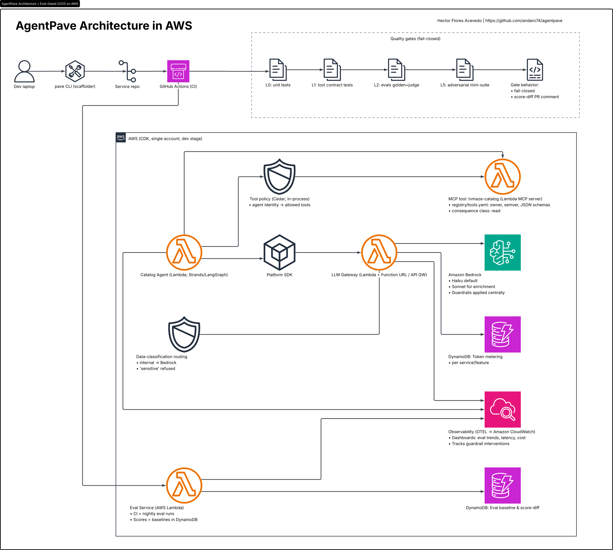

# AgentPave — Architecture

> **The paved road provides. The quality gate decides.**

## 1. Why this project exists

Most agentic AI demos prove that an agent can work. Very few prove that an
*organization* of agents can work — that a second, third, and tenth team could
ship governed, evaluated, observable agents without rebuilding the same
machinery every time. That is a platform problem, and the thesis of this
project is that the platform's defining property must be **quality engineering
baked into the infrastructure**: evaluation datasets, LLM-as-judge scoring,
guardrails, tracing, and a failing-closed CI quality gate that every scaffolded
service inherits at birth.

AgentPave demonstrates that thesis end to end at deliberately tiny scale:
*one command scaffolds a governed agent with evals, guardrails, tracing, and a
failing-closed CI quality gate already attached.* Tiny scale, production shape —
every component is the smallest thing that is still shaped correctly, and every
scope cut is documented as an ADR.

The demo narrative is three acts, each captured as a GIF:

- **Act 1 — Paved road.** `pave new catalog-agent --template agent-tools
  --classification internal` → scaffold → push → CI (unit + contract + eval
  gates) → deployed, traced, metered agent answering catalog questions.
  Zero to governed agent in minutes.
- **Act 2 — The gate bites.** A PR changes the prompt ("be more concise") →
  the eval gate fails on groundedness/completeness regression vs. baseline →
  merge blocked, score-diff table posted as a PR comment. A quality regression
  caught by infrastructure, not by a user. The red PR stays in history.
- **Act 3 — Self-healing.** A tool schema change breaks a contract test → a
  GitHub Action runs Claude Code headless → Claude proposes the repaired test
  as an `ai-proposed` PR with its reasoning → a human approves. The platform
  uses AI to maintain its own QA, under propose/dispose.

## 2. The sample use case riding the platform

**Streaming Catalog Concierge** — a single agent that answers questions about
TV shows and schedules, grounded in the free **TVMaze API** (keyless, generous
rate limits) exposed as an MCP tool.

Capabilities are deliberately capped at four so the golden dataset stays small:
"What network airs <show> and when is the next episode?", "Summarize <show> in
two sentences with genres", "Which of these shows are currently running?", and
a structured **enrichment mode**: given a show name, return a JSON metadata
record (title, genres, runtime, status, network, summary ≤50 words).
Structured output makes deterministic asserts easy and judge scoring meaningful.

## 3. Architecture


#### AWS Diagram


```
 dev laptop ── pave CLI (scaffolder) ──► service repo ──► GitHub Actions
                                                            │  L0 unit tests
                                                            │  L1 tool contract tests
                                                            │  L2 evals (golden set + judge)
                                                            │  L5 adversarial mini-suite
                                                            │  gate: fail-closed, score-diff PR comment
                                                            ▼
        ┌────────────────────────── AWS (CDK, one account, dev stage) ─────────────────────────┐
        │                                                                                      │
        │  Catalog Agent (Lambda, Strands/LangGraph)                                           │
        │      │ calls via platform SDK                                                        │
        │      ▼                                                                               │
        │  LLM GATEWAY (Lambda + Function URL/API GW)                                          │
        │    · Bedrock behind it (Haiku default, Sonnet routed for enrichment)                 │
        │    · Bedrock Guardrails applied centrally                                            │
        │    · data-classification routing (internal→Bedrock; `sensitive` refused by design)   │
        │    · token metering → DynamoDB (per service/feature)                                 │
        │      ▼                                                                               │
        │  MCP TOOL: tvmaze-catalog (Lambda MCP server)                                        │
        │    · registry/tools.yaml: owner, semver, JSON schemas, consequence class = read      │
        │    · policy: Cedar evaluated in-process — agent identity → allowed tools             │
        │                                                                                      │
        │  EVAL SERVICE (runs in CI + nightly Lambda)                                          │
        │    · golden dataset (repo, ~30 cases over recorded fixtures)                         │
        │    · deterministic asserts: JSON schema, latency budget, cost budget                 │
        │    · LLM-as-judge on Bedrock: groundedness, completeness, tone (judge calibrated     │
        │      on 10 hand-labeled cases; agreement published)                                  │
        │    · adversarial mini-suite (~10 probes incl. injection via tool-response fixture)   │
        │    · baseline store + score-diff → DynamoDB                                          │
        │                                                                                      │
        │  OBSERVABILITY: OTEL (GenAI semconv) → CloudWatch                                    │
        │    · dashboard-as-code: eval trend, tokens/cost per service, guardrail               │
        │      interventions, defect-leakage counter                                           │
        └──────────────────────────────────────────────────────────────────────────────────────┘
```

**Invariants** (each enforced, not asserted):

1. Every model call goes through the gateway. No service holds Bedrock
   permissions of its own — asserted in `cdk synth` IAM assertions.
2. Quality gates fail closed. A gate that errors blocks, never skips.
3. Nothing bills while idle (ADR-002).
4. `make check` is hermetic — no AWS account, no network beyond localhost.
5. Adversarial passes mean *"guardrail blocked, or policy denied and logged"* —
   never *"the model resisted."*

**Deliberate scope cuts** (each with an ADR — cuts are design decisions):
single AWS account/stage; no AgentCore Runtime (ADR-003 records the migration
path); Cedar evaluated in-process rather than via Amazon Verified Permissions;
no long-term memory; one template; one tool; no canary infrastructure —
`pave shadow-eval` (candidate vs. incumbent on the golden set) stands in.

## 4. Repo layout (monorepo)


```
agentpave/
├── CLAUDE.md                  # conventions, commands, standing rules for Claude Code
├── Makefile                   # the interface: check / deploy-dev / conformance / eval / walkthrough
├── .claude/
│   ├── skills/adr-writer/     # ADR template + tone
│   └── skills/eval-case-author/   (arrives M03)
│       # gate-report was listed here and is cut — the gate's PR comment is
│       # rendered by evalsvc/pr_comment.py, and must stay reproducible (ADR-033)
├── docs/
│   ├── ARCHITECTURE.md        # this file — the spec
│   ├── ROADMAP.md             # milestone build order, two gates each
│   ├── VALIDATION.md          # review log
│   ├── adr/                   # ADR-NNN-slug.md
│   └── diagrams/              # Mermaid → SVG via make diagrams
├── platform/
│   ├── gateway/               # Lambda: routing, guardrails, metering + tests   (M01)
│   ├── registry/              # tools.yaml, cedar policies + policy tests       (M02)
│   ├── mcp-tvmaze/            # MCP server + contract-test suite                (M02)
│   ├── evalsvc/               # harness, judges, baselines, adversarial suite   (M03)
│   └── infra/                 # CDK app: all stacks + dashboard-as-code         (M01+)
├── pave/                      # the CLI: new / eval / shadow-eval               (M03–M04)
├── templates/agent-tools/     # the golden path                                 (M04)
├── services/catalog-agent/    # the scaffolded sample service (committed)       (M04)
└── .github/workflows/         # gate.yml (M05) · selfheal.yml (M06) · nightly-eval.yml (M05)
```

## 5. Build order

See `docs/ROADMAP.md`. One milestone per day, M00–M07, each with a hermetic
gate (`make check`, no AWS) and a deployed gate (human-run after
`make deploy-dev`).

## 6. How Claude Code is used throughout

- **CLAUDE.md as the contract**: conventions, command vocabulary, standing rules.
- **Custom skills**: `adr-writer` (from M00) and `eval-case-author` (M03) — the
  same mechanism a full-scale platform's natural-language test creation would
  use. Both are *authoring* tools whose output a human curates before it lands.
  A third, `gate-report`, was planned for M05 and cut for that reason: nobody
  curates a CI comment, and a gate's explanation of why it blocked has to be
  byte-reproducible across runs (ADR-033).
- **Plan mode per milestone**; subagents/parallel worktrees where milestones
  decompose (infra vs. eval harness).
- **Hooks**: post-edit ruff + targeted pytest; pre-commit block on
  PII-looking strings in fixtures.
- **Dogfooding MCP**: the tvmaze MCP server registered in Claude Code's own
  configuration — the same governed tool serves the production agent and the
  developer's assistant.
- **Headless Claude Code in CI** for M06 self-healing — the platform maintained
  by the same AI tooling that built it, under propose/dispose with mandatory
  human review.
- **Dataset generation**: Claude drafts golden and adversarial cases; a human
  curates; the curation rate is recorded and published.

## 7. Open questions

Kept honestly open rather than resolved by fiat; revisited at M07.

- **Q1:** Should the judge score the *trajectory* (tool choice, step count) in
  this demo, or is answer-level scoring sufficient at one-tool scale? Trajectory
  evals are the full-platform answer; at one tool the signal may be trivial.
- ~~**Q2:** The defect-leakage counter needs a "prod-detected" increment path.
  Manual for the demo — what would the honest automated trigger be?~~
  **Answered in M05 (ADR-032), by fiat and against this section's own preamble:
  there is no honest automated trigger, because there is no production.** The
  counter is incremented by hand and the dashboard panel says so on its face.
  Deriving it from the gate's own failures is forbidden — a gate that fails is a
  defect *caught*, and charting that as leakage would make working controls look
  like escapes.
- **Q3:** `pave shadow-eval` compares on the golden set only. At what dataset
  size does that stop being a meaningful canary stand-in?
